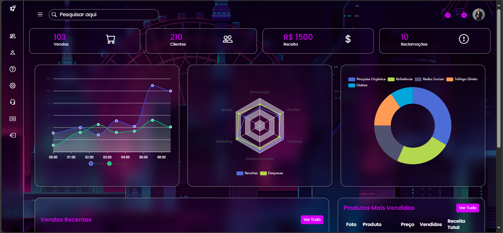

# 💻 Admin Dashboard

Um **painel administrativo moderno**, desenvolvido com **HTML, CSS e JavaScript puro**, com design translúcido e animações suaves utilizando `backdrop-filter`.  
Ideal para sistemas de controle, gestão de vendas, relatórios e visualização de dados.

---

## ✨ Funcionalidades

- 📁 **Sidebar interativa** — recolhe e expande com clique no menu lateral.  
- 🔍 **Barra de pesquisa** — estilizada com ícone e foco visual.  
- 📊 **Cards de estatísticas** — mostram números e ícones em tempo real (exemplo de dashboard).  
- 📈 **Gráficos e tabelas simuladas** — estrutura pronta para integração com dados reais.  
- 👤 **Seção de usuário** — com imagem de perfil e notificações.  
- 🧊 **Efeito de vidro (Glassmorphism)** — utilizando `backdrop-filter: blur()`.  
- 🧠 **Design responsivo** — adapta-se automaticamente para tablets e dispositivos móveis.

---

## 🛠️ Tecnologias utilizadas

| Tecnologia | Descrição |
|-------------|------------|
| **HTML5** | Estrutura semântica do painel |
| **CSS3** | Layout visual e efeitos de vidro |
| **JavaScript (ES6)** | Interações (toggle da sidebar, responsividade dinâmica) |
| **Google Fonts** | Fonte moderna — *Poppins* |
| **Bootstrap Icons** | Ícones leves e personalizáveis |

---

## ⚙️ Estrutura de pastas
```
📦 admin-dashboard
├── 📁 css/
│ └── style.css
├── 📁 images/
│ └── wp9008214.png
├── 📁 js/
│ └── script.js
├── index.html
└── README.md
```

---

## 🚀 Como executar o projeto

1. **Clone o repositório**
   ```bash
   git clone https://github.com/edufr0/dashboard.git
   
2. **Acesse a pasta do projeto**
  ```
  cd dashboard
  ```

3. Abra o arquivo `index.html` no navegador de sua preferência
ou utilize uma extensão como Live Server (VS Code) para visualização dinâmica.

## 🧩 Customização

Você pode:

Alterar as cores principais no arquivo `style.css` dentro da seção `:root`.

Substituir o background em:
```
    body {
        background: url(/images/wp9008214.png);
    }
```

Ajustar a largura da sidebar em `.sidebar` e `.sidebar.active`.

## 📸 Preview



## 👨‍💻 Autor

Eduardo Ferreira
📍 Projeto desenvolvido para fins de estudo e prática de UI/UX com HTML, CSS e JS.

## 📫 Contato: 
[LinkedIn](https://www.linkedin.com/in/eduardo-ferreira-90692b194/) · [GitHub](https://github.com/edufr0) · ✉️ eduardoy97.ef@gmail.com

## 📝 Licença

Este projeto está sob a licença MIT.
Sinta-se à vontade para usar, modificar e compartilhar com créditos ao autor.
